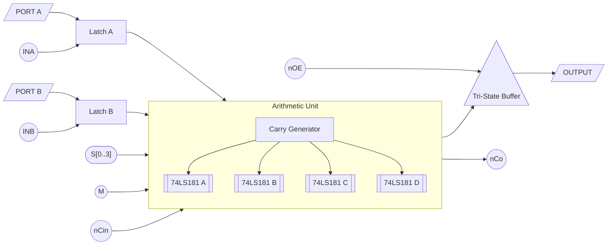

# Arithmetic Logic Unit
The Arithmetic Logic Unit is one of the the first PCBs I designed and built as part of the project. It is essentially a wrapper for the 74LS181 ICs, 4 of them handling each of the 4 nibbles, with additional circuitry to manage the IO and carry generation for each of the 4 chips.

## Carry Generation

Since each 74LS181 chip only handles 4 bits, 4 of these chips need to be used together. Instead of cascading them using the built-in carry outputs, I used full look-ahead carry generation which is more than 2x faster ([sn54s181](sn54s181.pdf)) (realistically both are fine at the speeds this works at, this is simply future/idiot proofing) But I couldn't find the carry generation chip, the 182, so I replicated the internal circuit using discrete (A)HCT gates ([sn54s182](sn54s182.pdf)).

Since I wasn't sure if this will work, I added test pads on the cascade carry outputs and inputs so they could be used as a contingency.

## Latches
The 181s need both A and B inputs driven at the same time to function correctly. Since they ultimately need to be driven by the same bus, the inputs are latched using separate signals which drive the physical inputs. I considered adding a second bus only to drive port B, but the added complexity was not worth the benefit of saving 1-2 microcode instructions and 2 control signals.

Inputs are latched at the rising edge. The AHCT16374's ([sn74ahct16374](sn74ahct16374.pdf)) are asynchronous, so the latching input is and'ed with the clock to make them "synchronous."

## Iterations
- v1.0: The control signals on the 16374 were routed wrong due to a schematic symbol mismatch
- v1.1: The 16374 was routed wrong (again)
- v1.2: Final