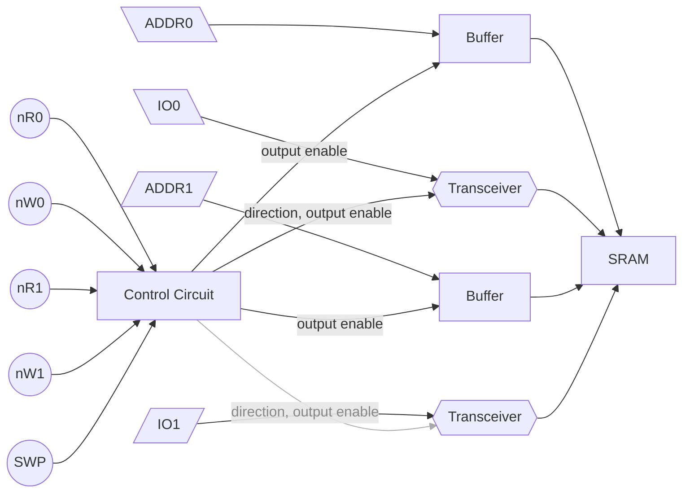

# Double Buffer
The double buffer is one of the most complicated PCBs in the project. It serves the important function of facilitating data transfer between the CPU and GPU.

```mermaid
flowchart LR
    ADDR0[\"ADDR0"\]
    IO0[\"IO0"\]
    buf1["Buffer"]
    buf2{{"Transceiver"}}
    sram["SRAM"]
    ADDR1[/"ADDR1"/]
    IO1[/"IO1"/]
    buf3["Buffer"]
    buf4{{"Transceiver"}}
    ctrl["`Control Circuit`"]
    nr0(("nR0"))
    nw0(("nW0"))
    nr1(("nR1"))
    nw1(("nW1"))
    swp(("SWP"))
    ADDR0 --> buf1
    IO0 --> buf2
    buf1 --> sram
    buf2 --> sram
    ADDR1 --> buf3
    IO1 --> buf4
    buf3 --> sram
    buf4 --> sram
    nr0 --> ctrl
    nw0 --> ctrl
    nr1 --> ctrl
    nw1 --> ctrl
    swp --> ctrl
    ctrl -->|"direction, output enable"| buf2
    ctrl -->|"direction, output enable"| buf4
    ctrl -->|"output enable"| buf1
    ctrl -->|"output enable"| buf3
    linkStyle 14 stroke:#aaaaaa,color:#888888
    %% mermaid-flow:pos ADDR0=292,326 IO0=295,462 buf1=482,329 buf2=482,462 sram=693,404 ADDR1=1056,323 IO1=1059,465 buf3=887,323 buf4=884,465 ctrl=689,899 nr0=302,1107 nw0=302,977 nr1=302,847 nw1=302,717 swp=302,587
```